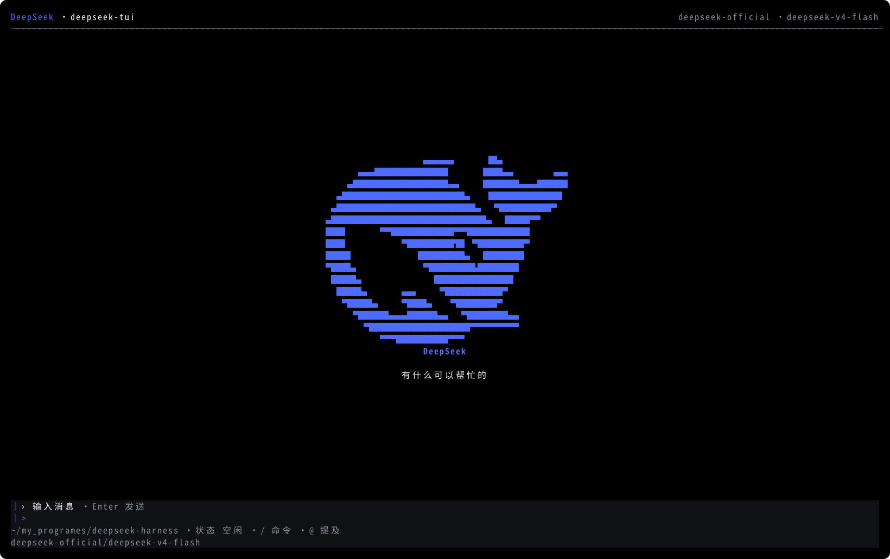
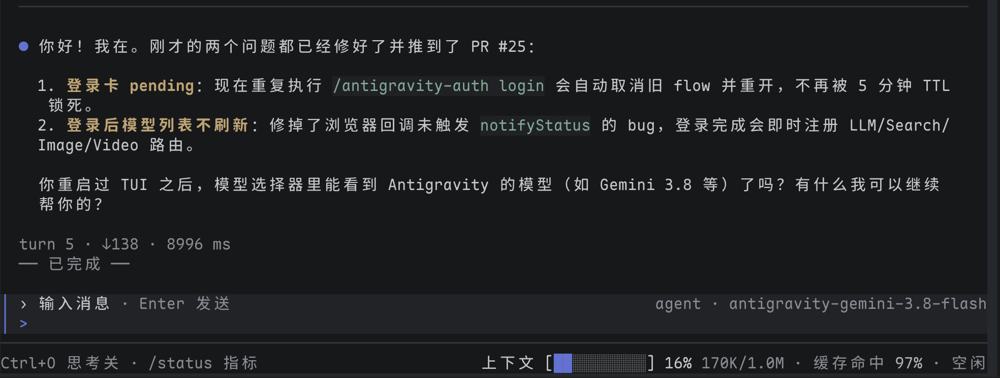

# dsh-tui — DeepSeek Harness terminal interface

English | [中文](README.zh.md)

[](https://github.com/zhangyang-crazy-one/dsh-tui/actions/workflows/ci.yml)
[](https://github.com/zhangyang-crazy-one/dsh-tui/releases)
[](https://www.npmjs.com/package/@crazyhappyone/dsh-tui)

## Summary

`@crazyhappyone/dsh-tui` provides the `dsh-tui` command for running and safely updating the DeepSeek Harness terminal interface. The launcher manages a dedicated DSH source checkout, so it never pulls, resets, stashes, or cleans a contributor's development checkout. This public repository also mirrors the `packages/tui/` bundle and renderer sources for review. DSH continues to own agents, sessions, tools, persistence, providers, permissions, and profile assembly.

## Table of Contents

- [Screenshots](#screenshots)
- [Install the launcher](#install-the-launcher)
- [Run and update](#run-and-update)
- [Configure the source runtime](#configure-the-source-runtime)
- [Relationship to DSH](#relationship-to-dsh)
- [Packages](#packages)
- [Development workflow](#development-workflow)
- [Publish the npm package](#publish-the-npm-package)
- [Known limitations](#known-limitations)
- [Dev Note](#dev-note)

-----

<a id="screenshots"></a>
## Screenshots

Idle home:



After sending `你好`:



-----

<a id="install-the-launcher"></a>
## Install the launcher

The unscoped `dsh-tui` package belongs to another maintainer. This project publishes only under the authenticated `crazyhappyone` npm scope.

The launcher requires Git, pnpm, and a DSH-supported Node version. Installing `@deepseek-ai/dsh` separately is neither required nor used: `dsh-tui` always runs the `deepseek-tui` profile from its dedicated source checkout.

Install the prerelease and complete the first launch:

```text
npm install --global @crazyhappyone/dsh-tui@next
dsh-tui version
dsh-tui update
dsh-tui
```

Package installation creates only the launcher. It does not clone DSH, run `pnpm install`, prompt for Git credentials, or execute a postinstall script. The explicit `dsh-tui update` command creates the source runtime; its default private source requires repository authorization.

-----

<a id="run-and-update"></a>
## Run and update

After initialization, run `dsh-tui` from the workspace that the agent should use:

```text
dsh-tui
```

Run `dsh-tui update` when you want to refresh the dedicated runtime before launching it again.

Ordinary arguments pass to the `deepseek-tui` profile unchanged:

```text
dsh-tui "review this repository"
dsh-tui --resume <session-id>
dsh-tui --cwd <directory>
```

`dsh-tui update` clones the configured source when the runtime is absent. For an existing runtime it requires a clean worktree, fetches the configured ref, proves the current HEAD is its ancestor, applies only `git merge --ff-only`, and runs `pnpm install --frozen-lockfile`. Dirty or divergent history stops before HEAD changes.

`dsh-tui version` reports the launcher version, runtime directory, runtime Git SHA, and DSH version without network access. The exact words `update` and `version` are launcher commands; use `dsh-tui -- update` or `dsh-tui -- version` to send either word as a TUI task.

Updating the launcher and updating the runtime are separate operations:

```text
npm install --global @crazyhappyone/dsh-tui@next
dsh-tui update
```

-----

<a id="configure-the-source-runtime"></a>
## Configure the source runtime

The defaults track the owner's private `feat/deepseek-tui` branch. Git authorization for that repository is required. Other users can select a compatible accessible repository and ref.

| Environment variable | Default | Purpose |
|---|---|---|
| `DSH_TUI_RUNTIME_DIR` | `~/.local/share/dsh-tui/runtime` | Dedicated clone used only by the launcher |
| `DSH_TUI_SOURCE_URL` | `https://github.com/zhangyang-crazy-one/deepseek-harness.git` | Git remote cloned and fetched by `update` |
| `DSH_TUI_SOURCE_REF` | `feat/deepseek-tui` | Branch or ref fetched by `update` |
| `DSH_TUI_PNPM` | `pnpm` | pnpm executable used for install and launch |

Values must be non-empty, and the runtime directory must be absolute. The launcher refuses a symbolic-link runtime path and an existing directory that is not a Git checkout. Child commands receive argument arrays without shell interpolation.

If dependency refresh fails after a fast-forward, the runtime stays at the reported new SHA but is not ready. Run the exact recovery command printed by the launcher. For dirty or divergent state, inspect only the dedicated runtime directory or select a new empty `DSH_TUI_RUNTIME_DIR`; the launcher never discards it automatically.

-----

<a id="relationship-to-dsh"></a>
## Relationship to DSH

The TUI is a DSH profile layer, not a separate agent runtime:

```text
@deepseek-ai/dsh-base
  └─ @deepseek-ai/dsh-tui          profile patch, terminal lifecycle, controller
       └─ @deepseek-ai/dsh-tui-render   Ink projection and terminal I/O
```

The integration source lives on the private [`feat/deepseek-tui` DSH branch](https://github.com/zhangyang-crazy-one/deepseek-harness/tree/feat/deepseek-tui/packages/tui). Changes that affect DSH services, profile composition, assembled CLI snapshots, or Agent Notes belong in that monorepo and follow its architecture, testing, and documentation rules.

-----

<a id="packages"></a>
## Packages

| Package | DSH shape | Responsibility |
|---|---|---|
| [`tui/`](tui/README.md) | Profile bundle plus runtime plugin | Composes the terminal layer over `dsh-base`, owns the live terminal session, and maps user actions to DSH services |
| [`tui-render/`](tui-render/README.md) | Library | Projects controller state through Ink without owning agents, persistence, or model requests |

-----

<a id="development-workflow"></a>
## Development workflow

Implement TUI behavior in the complete DSH checkout, run the checks selected by the changed behavior, and export the confirmed `packages/tui/` tree here. Develop the launcher in this repository with `npm test`; test installation through a packed tarball rather than a workspace link.

The launcher runtime must remain separate from the development checkout. To test against another source safely, point `DSH_TUI_RUNTIME_DIR` at a temporary absolute directory and configure `DSH_TUI_SOURCE_URL` and `DSH_TUI_SOURCE_REF`.

-----

<a id="publish-the-npm-package"></a>
## Publish the npm package

GitHub Actions tests every pull request and push to `main` on Node 22.19 and 24. Publishing starts only when a GitHub Release is published. The workflow rejects a release tag unless it equals `v` followed by the version in `package.json`; prereleases publish to npm's `next` tag and stable releases publish to `latest`.

Configure npm Trusted Publishing once after `publish.yml` is present on the default branch. npm CLI 11.5.1 or newer can register the GitHub workflow through an authenticated browser session. The command below runs a compatible npm 11 temporarily and does not replace the globally installed npm:

```text
npx --yes npm@11 trust github @crazyhappyone/dsh-tui \
  --file publish.yml \
  --repository zhangyang-crazy-one/dsh-tui \
  --allow-publish
```

The equivalent npm website settings are organization or user `zhangyang-crazy-one`, repository `dsh-tui`, workflow filename `publish.yml`, with no environment restriction. The workflow uses GitHub OIDC and stores no npm token, password, or OTP.

For each release, bump `package.json`, merge the change after CI passes, then create a GitHub Release whose tag matches the package version:

```text
gh release create v0.1.0-alpha.3 --prerelease --generate-notes
```

The `Publish npm` workflow runs tests and packed-package verification again before publishing. Do not rerun an old release tag: npm versions are immutable. Promotion to stable is a new version and a non-prerelease GitHub Release.

-----

<a id="known-limitations"></a>
## Known limitations

- **Private default source** — npm installation is public, but the default DSH runtime remote requires repository authorization; anonymous users must configure an accessible compatible source.
- **Source toolchain required** — runtime initialization requires Git, pnpm, and a DSH-supported Node version.
- **No automatic conflict resolution** — dirty or non-fast-forward runtime history requires explicit human action or a new runtime directory.
- **Runtime update is not launcher update** — `dsh-tui update` refreshes DSH source and dependencies; npm updates the launcher package.
- **Integration owns release readiness** — launcher success does not replace the DSH branch's behavior, snapshot, build, or hygiene checks.

<a id="dev-note"></a>
## Dev Note

None.
